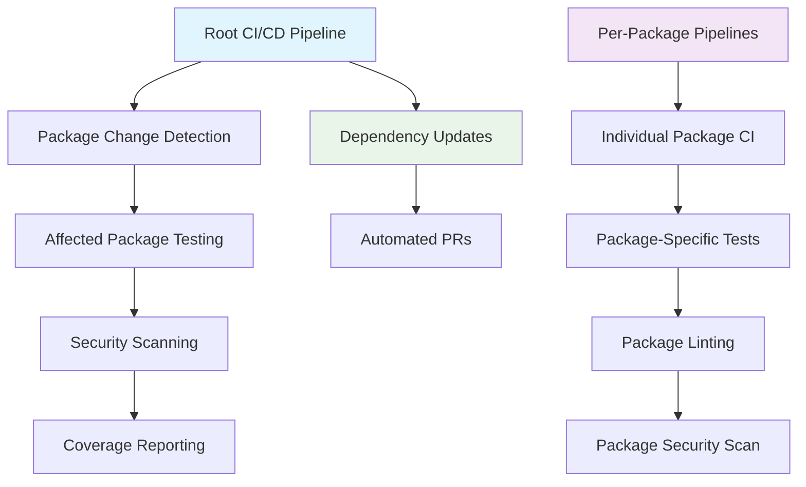

# 🚀 GoVel Framework - CI/CD Documentation

## Table of Contents

1. [Overview](#overview)
2. [Architecture](#architecture)
3. [Root-Level CI/CD](#root-level-cicd)
4. [Per-Package CI/CD](#per-package-cicd)
5. [GitHub Actions Workflows](#github-actions-workflows)
6. [Configuration Files](#configuration-files)
7. [Build Automation](#build-automation)
8. [Setup and Usage](#setup-and-usage)
9. [Troubleshooting](#troubleshooting)
10. [Contributing](#contributing)

---

## Overview

The GoVel Framework employs a comprehensive CI/CD infrastructure designed to ensure code quality, security, and reliability across all packages. The system operates on two levels:

- **🌐 Root-Level**: Monorepo-wide CI/CD orchestration for the entire framework
- **📦 Package-Level**: Individual CI/CD pipelines for each package in the ecosystem

### Key Features

- ✅ **Multi-version Go testing** (Go 1.21, 1.22, 1.23)
- ✅ **Cross-platform compatibility** (Linux, macOS, Windows)
- ✅ **Smart change detection** for efficient builds
- ✅ **Comprehensive security scanning** (gosec, govulncheck)
- ✅ **Code coverage tracking** with quality gates
- ✅ **Automated dependency management** via Dependabot
- ✅ **Professional linting** with 50+ rules
- ✅ **Build automation** with Make targets

---

## Architecture



### Directory Structure

```
govel/
├── .github/
│   ├── workflows/           # Root-level GitHub Actions
│   │   ├── ci.yml          # Main CI pipeline
│   │   ├── security.yml    # Security scanning
│   │   └── dependency-update.yml
│   └── dependabot.yml      # Dependency automation
├── packages/
│   └── [package-name]/
│       ├── .github/
│       │   └── workflows/
│       │       └── ci.yml  # Package-specific CI
│       ├── .golangci.yml   # Package linting config
│       ├── Makefile        # Package build automation
│       └── src/            # Package source code
├── docs/
│   └── CICD_DOCUMENTATION.md
├── .golangci.yml           # Root linting config
├── .codecov.yml            # Coverage reporting config
├── Makefile                # Root build automation
└── setup-cicd.sh           # CI/CD setup script
```

---

## Root-Level CI/CD

### Main CI Pipeline (`.github/workflows/ci.yml`)

The main CI pipeline provides comprehensive testing and quality assurance for the entire GoVel framework.

#### Triggers
- **Push events** to `main` or `develop` branches
- **Pull requests** targeting `main` or `develop`
- **Manual workflow dispatch** with optional parameters

#### Features

**🔍 Smart Change Detection**
```yaml
detect-changes:
  runs-on: ubuntu-latest
  outputs:
    packages: ${{ steps.changes.outputs.packages }}
    has-changes: ${{ steps.changes.outputs.has-changes }}
```

**🧪 Multi-Version Testing Matrix**
```yaml
strategy:
  matrix:
    os: [ubuntu-latest, macos-latest, windows-latest]
    go-version: ['1.21', '1.22', '1.23']
```

**📊 Coverage Integration**
- Merged coverage reports from all packages
- Codecov integration with quality gates
- 80% coverage threshold enforcement

#### Pipeline Stages

1. **📦 Package Change Detection**
   - Identifies modified packages since last commit
   - Optimizes build time by testing only affected packages
   - Supports manual override to test all packages

2. **🧪 Comprehensive Testing**
   - Parallel testing across multiple Go versions and OS
   - Race condition detection with `-race` flag
   - Coverage collection with atomic mode

3. **🔍 Code Quality Checks**
   - `go vet` static analysis
   - Format verification with `gofmt`
   - Import organization validation

4. **🔒 Security Scanning**
   - gosec security vulnerability detection
   - govulncheck for known CVE scanning
   - SARIF integration with GitHub Security tab

5. **📊 Reporting**
   - Coverage report generation and upload
   - Artifact preservation for 30 days
   - Integration with external reporting tools

### Security Pipeline (`.github/workflows/security.yml`)

Dedicated security scanning workflow that runs independently to ensure comprehensive security coverage.

#### Features
- **🛡️ gosec**: Static security analysis
- **🔍 govulncheck**: Vulnerability database scanning
- **📋 SARIF reporting**: Integration with GitHub Security tab
- **🔄 Scheduled scanning**: Weekly automated security audits

### Dependency Management (`.github/workflows/dependency-update.yml`)

Automated dependency management using Dependabot and custom update strategies.

#### Features
- **📅 Scheduled updates**: Weekly dependency scanning
- **🔄 Automated PRs**: Auto-generated update pull requests
- **🧪 Integration testing**: Automatic testing of dependency updates
- **📊 Compatibility checks**: Multi-version Go compatibility validation

---

## Per-Package CI/CD

Each package in the GoVel ecosystem has its own dedicated CI/CD pipeline optimized for individual package requirements.

### Package-Specific Workflows

#### Location
```
packages/[package-name]/.github/workflows/ci.yml
```

#### Features
- **🎯 Path-based triggers**: Only runs when package files change
- **⚡ Optimized testing**: Package-specific test execution
- **📊 Individual coverage**: Package-level coverage tracking
- **🔒 Package security**: Dedicated security scanning per package

#### Example Workflow Structure
```yaml
name: 🧪 [Package-Name] CI

on:
  push:
    paths:
      - 'packages/[package-name]/**'
  pull_request:
    paths:
      - 'packages/[package-name]/**'

env:
  PACKAGE_PATH: packages/[package-name]
  GO_VERSION: '1.23'
  COVERAGE_THRESHOLD: 80

jobs:
  test:
    # Package-specific testing logic
  security:
    # Package-specific security scanning
```

### Package Build Automation

Each package includes a dedicated `Makefile` with standardized targets:

```bash
# Navigation
make help          # Show all available targets

# Building
make build         # Build the package
make clean         # Clean artifacts and caches

# Testing
make test          # Run tests with coverage
make test-short    # Quick tests without coverage
make coverage      # Generate HTML coverage report

# Quality Assurance
make lint          # Run golangci-lint
make fmt           # Format code
make vet           # Run go vet
make security      # Security scans

# Development
make dev-setup     # Install development tools
make deps          # Download dependencies
make update-deps   # Update dependencies

# Complete Pipeline
make all           # Run complete CI pipeline
```

---

## GitHub Actions Workflows

### Workflow Files Overview

| Workflow | Location | Purpose | Triggers |
|----------|----------|---------|-----------|
| **Main CI** | `.github/workflows/ci.yml` | Comprehensive testing and QA | Push, PR, Manual |
| **Security** | `.github/workflows/security.yml` | Security scanning and auditing | Push, PR, Schedule |
| **Dependencies** | `.github/workflows/dependency-update.yml` | Automated dependency updates | Schedule, Manual |
| **Package CI** | `packages/*/workflows/ci.yml` | Package-specific pipelines | Path-based triggers |

### Workflow Permissions

All workflows follow the principle of least privilege:

```yaml
permissions:
  contents: read          # Read repository contents
  security-events: write # Upload security findings
  pull-requests: write   # Comment on PRs
  checks: write          # Update check status
```

### Environment Variables

Key environment variables used across workflows:

```yaml
env:
  GO_VERSION_MATRIX: "1.21,1.22,1.23"
  COVERAGE_THRESHOLD: 80
  CODECOV_TOKEN: ${{ secrets.CODECOV_TOKEN }}
  # Package-specific
  PACKAGE_PATH: packages/[package-name]
  GO_VERSION: '1.23'
```

### Caching Strategy

Optimized caching for faster builds:

```yaml
- name: 📦 Cache Go modules
  uses: actions/cache@v3
  with:
    path: |
      ~/go/pkg/mod
      ~/.cache/go-build
    key: ${{ runner.os }}-go-${{ matrix.go-version }}-${{ hashFiles('**/go.sum') }}
    restore-keys: |
      ${{ runner.os }}-go-${{ matrix.go-version }}-
```

---

## Configuration Files

### Root-Level Configurations

#### `.golangci.yml` - Linting Configuration

Comprehensive linting with 50+ rules across multiple categories:

**Enabled Linters:**
- **Code Quality**: `gocritic`, `gocyclo`, `goconst`
- **Security**: `gosec`, `gas`
- **Style**: `gofmt`, `goimports`, `misspell`
- **Logic**: `errcheck`, `ineffassign`, `staticcheck`
- **Performance**: `prealloc`, `unconvert`

**Key Settings:**
```yaml
run:
  timeout: 10m
  tests: true
  modules-download-mode: readonly

issues:
  max-issues-per-linter: 0
  max-same-issues: 0
  exclude-use-default: false

linters-settings:
  gocyclo:
    min-complexity: 15
  gocritic:
    enabled-tags:
      - diagnostic
      - style
      - performance
      - experimental
```

#### `.codecov.yml` - Coverage Configuration

Advanced coverage tracking with quality gates:

```yaml
coverage:
  status:
    project:
      default:
        target: 80%
        threshold: 1%
    patch:
      default:
        target: 80%

comment:
  layout: "reach,diff,flags,tree,reach"
  behavior: default
  require_changes: false
```

#### `Makefile` - Build Automation

Root-level Makefile with 25+ targets for comprehensive project management:

**Key Targets:**
- `make build` - Build all packages
- `make test` - Run comprehensive test suite
- `make lint` - Lint all packages
- `make security` - Security scanning
- `make coverage-report` - Generate coverage reports
- `make dev-setup` - Development environment setup
- `make all` - Complete CI pipeline

### Per-Package Configurations

#### Package `.golangci.yml`

Each package has tailored linting rules:

```yaml
run:
  timeout: 5m
  tests: true
  modules-download-mode: readonly

linters:
  enable:
    - errcheck
    - gosimple
    - govet
    - ineffassign
    - staticcheck
    - unused
    - gocritic
    - gocyclo
    - gosec
    - misspell
    - revive

linters-settings:
  gocyclo:
    min-complexity: 15
  gosec:
    excludes:
      - G104  # Audit errors not checked
```

#### Package `Makefile`

Standardized per-package automation:

```makefile
# Determine source directory structure
WORKING_DIR := $(shell if [ -f "src/go.mod" ]; then echo "src"; else echo "."; fi)

# Standard targets
build: ## 🔨 Build the package
test: ## 🧪 Run tests with coverage
lint: ## 🔍 Run golangci-lint
security: ## 🔒 Run security scans
all: clean fmt vet lint test security ## 🚀 Complete pipeline
```

---

## Build Automation

### Root-Level Make Targets

The root `Makefile` provides comprehensive project-wide automation:

#### Information and Discovery
```bash
make help          # Show all available targets
make info          # Display project information
make list-packages # List all Go packages
```

#### Building and Testing
```bash
make build             # Build all packages
make test              # Run all tests with coverage
make test-quick        # Quick tests without coverage
make test-verbose      # Verbose test output
make benchmark         # Run benchmark tests
```

#### Code Quality
```bash
make lint              # Run golangci-lint on all packages
make lint-fix          # Auto-fix linting issues
make format            # Format all code
make vet               # Run go vet on all packages
```

#### Security
```bash
make security              # Run all security scans
make security-gosec        # Run gosec scanner
make security-govulncheck  # Run vulnerability scanner
```

#### Coverage Reporting
```bash
make coverage-merge    # Merge all coverage reports
make coverage-html     # Generate HTML coverage report
make coverage-report   # Show coverage summary
```

#### Dependency Management
```bash
make deps-download     # Download all dependencies
make deps-tidy         # Tidy all go.mod files
make deps-verify       # Verify dependencies
make deps-update       # Update dependencies
```

#### Development
```bash
make dev-setup         # Set up development environment
make dev-reset         # Reset development environment
make pre-release       # Run pre-release checks
make check-all         # Run all quality checks
```

#### Complete Pipelines
```bash
make all               # Complete build pipeline
make quick             # Quick build and test
```

### Package-Level Make Targets

Each package `Makefile` provides package-specific automation:

#### Basic Operations
```bash
make build         # Build the package
make clean         # Clean build artifacts
make test          # Run tests with coverage
make test-short    # Quick tests
```

#### Quality Assurance
```bash
make lint          # Package-specific linting
make fmt           # Format package code
make vet           # Run go vet on package
make security      # Package security scanning
```

#### Coverage and Reporting
```bash
make coverage      # Generate coverage report
```

#### Development
```bash
make dev-setup     # Install package development tools
make deps          # Download package dependencies
make update-deps   # Update package dependencies
```

#### Complete Pipeline
```bash
make all           # Run complete package CI pipeline
```

---

## Setup and Usage

### Initial Setup

#### 1. Repository Setup Scripts

**Main CI/CD Setup:**
```bash
# Run the main CI/CD setup script
./setup-cicd.sh

# Options available:
./setup-cicd.sh --dry-run     # Preview what will be created
./setup-cicd.sh --verbose     # Detailed output
./setup-cicd.sh --force       # Overwrite existing files
```

**Per-Package CI/CD Setup:**
```bash
# Run the per-package setup script
./setup-per-package-cicd.sh

# Options available:
./setup-per-package-cicd.sh --dry-run   # Preview
./setup-per-package-cicd.sh --force     # Overwrite existing
```

#### 2. Development Environment Setup

**Root-Level Development Setup:**
```bash
make dev-setup
```

**Package-Level Development Setup:**
```bash
# For each package you're working on
cd packages/[package-name]
make dev-setup
```

#### 3. GitHub Repository Configuration

**Required Secrets:**
- `CODECOV_TOKEN` - For coverage reporting integration

**GitHub Actions Settings:**
1. Navigate to repository Settings → Actions → General
2. Ensure "Allow all actions and reusable workflows" is selected
3. Enable "Allow GitHub Actions to create and approve pull requests"

### Daily Development Workflow

#### Working on Root-Level Changes
```bash
# 1. Make your changes
git checkout -b feature/my-feature

# 2. Run quality checks
make lint
make test
make security

# 3. Or run everything at once
make all

# 4. Commit and push
git add .
git commit -m "feat: add new feature"
git push origin feature/my-feature
```

#### Working on Package-Level Changes
```bash
# 1. Navigate to package
cd packages/my-package

# 2. Run package-specific checks
make lint
make test
make security

# 3. Or run complete package pipeline
make all

# 4. Return to root and commit
cd ../..
git add .
git commit -m "feat(my-package): add new feature"
git push origin feature/my-feature
```

#### Pre-Release Checklist
```bash
# Run comprehensive pre-release checks
make pre-release

# This includes:
# - All tests across all packages
# - Security scanning
# - Linting
# - Coverage verification
# - Dependency verification
```

### Continuous Integration Usage

#### Triggering Builds

**Automatic Triggers:**
- Push to `main` or `develop` branches
- Pull requests to `main` or `develop` branches
- Package-specific changes trigger package pipelines

**Manual Triggers:**
- Navigate to Actions tab in GitHub
- Select "CI Pipeline" workflow
- Click "Run workflow"
- Choose options:
  - Test all packages (ignore change detection)
  - Skip security scanning

#### Monitoring Builds

**GitHub Actions Dashboard:**
- View running and completed workflows
- Download build artifacts
- View test results and coverage reports

**Coverage Reports:**
- Codecov dashboard integration
- PR comments with coverage changes
- Coverage trend tracking

---

## Troubleshooting

### Common Issues and Solutions

#### Build Failures

**❌ Go Module Issues**
```bash
# Problem: Module not found or version conflicts
# Solution:
cd packages/[affected-package]/src
go mod tidy
go mod verify
```

**❌ Missing Dependencies**
```bash
# Problem: Package dependencies not available
# Solution:
make deps-download    # Root level
# OR
cd packages/[package]
make deps            # Package level
```

**❌ Test Failures**
```bash
# Problem: Tests failing in CI but passing locally
# Solution: Check for race conditions
go test -race ./...

# Check for platform-specific issues
GOOS=linux go test ./...
GOOS=windows go test ./...
```

#### Linting Issues

**❌ Linting Failures**
```bash
# Problem: golangci-lint failures
# Solution: Auto-fix where possible
make lint-fix

# Check specific linter output
golangci-lint run --verbose
```

**❌ Format Issues**
```bash
# Problem: Code formatting violations
# Solution:
make format    # Root level
# OR
cd packages/[package]
make fmt      # Package level
```

#### Coverage Issues

**❌ Coverage Below Threshold**
```bash
# Problem: Coverage below 80% threshold
# Solution: Identify uncovered code
make coverage-html
open coverage/coverage.html

# Or get text summary
make coverage-report
```

**❌ Coverage Report Generation**
```bash
# Problem: Coverage reports not generating
# Solution: Ensure gocovmerge is installed
go install github.com/wadey/gocovmerge@latest

# Regenerate reports
make coverage-merge
```

#### Security Scanning Issues

**❌ Security Scan Failures**
```bash
# Problem: gosec or govulncheck failures
# Solution: Review and address findings

# Run specific scanner
make security-gosec
make security-govulncheck

# Check for false positives in .golangci.yml
```

#### CI/CD Pipeline Issues

**❌ Workflow Permissions**
```bash
# Problem: GitHub Actions permission errors
# Solution: Check repository settings
# Settings → Actions → General → Workflow permissions
```

**❌ Secrets Missing**
```bash
# Problem: CODECOV_TOKEN not found
# Solution: Add to repository secrets
# Settings → Secrets and variables → Actions → New repository secret
```

### Debug Commands

#### Local Debugging
```bash
# Verbose test output
go test -v ./...

# Race condition detection
go test -race ./...

# Build with verbose output
go build -v ./...

# Check module status
go mod why [package]
go mod graph
```

#### CI Environment Simulation
```bash
# Simulate CI environment variables
export CI=true
export GITHUB_ACTIONS=true

# Run with CI-like settings
make test
```

### Performance Optimization

#### Build Performance
```bash
# Use build cache
export GOCACHE=/path/to/cache
go build -x ./...

# Parallel builds
make -j4 build
```

#### Test Performance
```bash
# Parallel testing
go test -parallel 4 ./...

# Short tests for quick feedback
go test -short ./...
```

---

## Contributing

### Adding New Packages

When adding a new package to the GoVel ecosystem:

#### 1. Create Package Structure
```bash
mkdir -p packages/new-package/src
cd packages/new-package/src
go mod init govel/new-package
```

#### 2. Set Up CI/CD for New Package
```bash
# Return to root
cd ../../..

# Run per-package setup (will detect new package)
./setup-per-package-cicd.sh
```

#### 3. Verify Setup
```bash
cd packages/new-package
make help    # Verify Makefile works
make build   # Test build process
make test    # Test CI pipeline
```

### Modifying CI/CD Configuration

#### Root-Level Changes
1. **Workflow modifications**: Edit `.github/workflows/*.yml`
2. **Linting rules**: Update `.golangci.yml`
3. **Coverage settings**: Modify `.codecov.yml`
4. **Build automation**: Update root `Makefile`

#### Package-Level Changes
1. **Package workflows**: Edit `packages/*/workflows/ci.yml`
2. **Package linting**: Modify `packages/*/.golangci.yml`
3. **Package automation**: Update `packages/*/Makefile`

### Testing CI/CD Changes

#### Local Testing
```bash
# Test workflow syntax (requires act)
act -j test --dry-run

# Test make targets
make all --dry-run
```

#### Branch Testing
```bash
# Create feature branch
git checkout -b ci/improve-pipeline

# Make changes and push
git add .
git commit -m "ci: improve pipeline performance"
git push origin ci/improve-pipeline

# Create PR to test changes
```

### Best Practices

#### Workflow Design
- ✅ Use minimal permissions
- ✅ Implement proper error handling
- ✅ Cache dependencies appropriately
- ✅ Use matrix strategies for parallel execution
- ✅ Include meaningful job names and descriptions

#### Configuration Management
- ✅ Centralize common settings
- ✅ Use environment variables for flexibility
- ✅ Document configuration changes
- ✅ Version configuration files

#### Testing Strategy
- ✅ Test on multiple platforms
- ✅ Use multiple Go versions
- ✅ Include race condition detection
- ✅ Maintain high coverage standards

---

## Appendix

### File Reference

#### Root-Level Files
```
govel/
├── .github/
│   ├── workflows/
│   │   ├── ci.yml                    # Main CI pipeline
│   │   ├── security.yml              # Security scanning
│   │   └── dependency-update.yml     # Dependency management
│   └── dependabot.yml                # Dependabot configuration
├── .golangci.yml                     # Root linting configuration
├── .codecov.yml                      # Coverage configuration
├── Makefile                          # Root build automation
├── setup-cicd.sh                     # Main setup script
└── setup-per-package-cicd.sh         # Per-package setup script
```

#### Per-Package Files
```
packages/[package-name]/
├── .github/
│   └── workflows/
│       └── ci.yml                    # Package-specific CI
├── .golangci.yml                     # Package linting config
├── Makefile                          # Package build automation
└── src/                              # Package source code
    ├── go.mod                        # Go module definition
    ├── go.sum                        # Dependency checksums
    └── ...                           # Package implementation
```

### Command Reference

#### Root-Level Commands
```bash
# Setup
./setup-cicd.sh [--dry-run|--verbose|--force]
./setup-per-package-cicd.sh [--dry-run|--verbose|--force]

# Information
make help
make info
make list-packages

# Building
make build
make clean

# Testing
make test [--verbose]
make test-quick
make benchmark

# Quality Assurance
make lint [--fix]
make format
make vet
make security

# Coverage
make coverage-merge
make coverage-html
make coverage-report

# Dependencies
make deps-download
make deps-tidy
make deps-verify
make deps-update

# Development
make dev-setup
make dev-reset

# Complete Pipelines
make all
make quick
make pre-release
make check-all
```

#### Package-Level Commands
```bash
# Navigate to package
cd packages/[package-name]

# Basic operations
make help
make build
make clean
make test
make test-short

# Quality assurance
make lint
make fmt
make vet
make security

# Coverage
make coverage

# Development
make dev-setup
make deps
make update-deps

# Complete pipeline
make all
```

### Environment Variables

#### GitHub Actions Environment
```bash
CI=true
GITHUB_ACTIONS=true
GITHUB_WORKFLOW="CI Pipeline"
GITHUB_RUN_ID="123456789"
GITHUB_RUN_NUMBER="42"
GITHUB_REF="refs/heads/main"
GITHUB_SHA="abc123..."
```

#### Go Environment
```bash
GO_VERSION="1.23"
GOOS="linux|darwin|windows"
GOARCH="amd64|arm64"
CGO_ENABLED="0|1"
```

#### CI/CD Configuration
```bash
COVERAGE_THRESHOLD="80"
CODECOV_TOKEN="<secret>"
PACKAGE_PATH="packages/[package-name]"
```

---

*This documentation is automatically updated as part of the GoVel CI/CD infrastructure. For the latest version, refer to the repository's docs folder.*

**Last Updated**: 2025-09-13  
**Version**: 1.0.0  
**Maintained by**: GoVel Framework Team