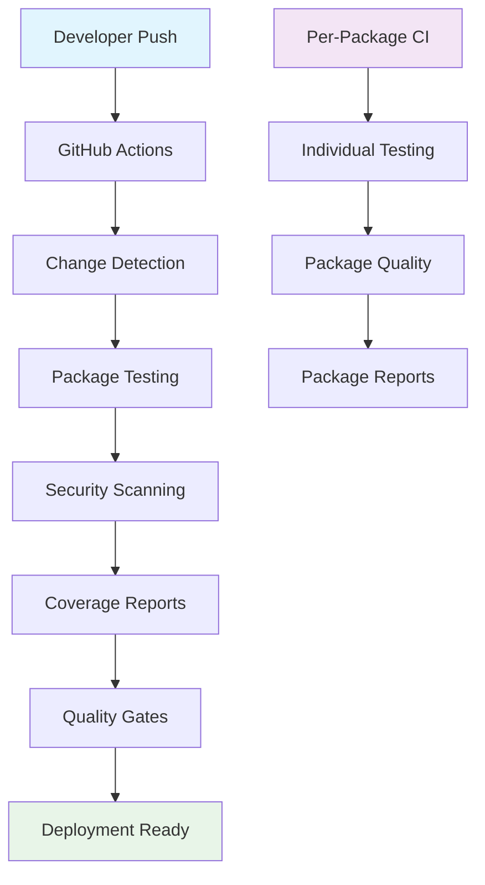

# 📚 GoVel Framework Documentation

Welcome to the comprehensive documentation for the GoVel Framework! This documentation covers all aspects of development, CI/CD infrastructure, and project guidelines.

## 📋 Table of Contents

### 🚀 CI/CD Infrastructure
- **[CI/CD Setup Guide](./CICD_SETUP_GUIDE.md)** - Complete setup instructions for new developers
- **[CI/CD Documentation](./CICD_DOCUMENTATION.md)** - Comprehensive CI/CD infrastructure guide
- **[CI/CD Quick Reference](./CICD_QUICK_REFERENCE.md)** - Quick commands and workflows

### 🏗️ Development Guidelines
- **[Development Rules](./DEVELOPMENT_RULES.md)** - Coding standards and best practices
- **[Application Package Blueprint](./APPLICATION_PACKAGE_BLUEPRINT.md)** - Package development guide
- **[Laravel Application Enhancements](./LARAVEL_APPLICATION_ENHANCEMENTS.md)** - Laravel integration guide

---

## 🎯 Quick Start

### New Developer Setup
```bash
# 1. Clone the repository
git clone https://github.com/your-org/govel.git
cd govel

# 2. Run setup scripts
./setup-cicd.sh
./setup-per-package-cicd.sh

# 3. Install development tools
make dev-setup

# 4. Verify setup
make all
```

**⏱️ Total setup time: 5-10 minutes**

### Daily Development Workflow
```bash
# Quick development cycle
make test lint          # Quality checks
make all               # Full pipeline
git add . && git commit -m "feat: description"
git push origin feature-branch
```

---

## 📖 Documentation Overview

### 🚀 CI/CD Infrastructure Documentation

#### [CI/CD Setup Guide](./CICD_SETUP_GUIDE.md) 
**👥 Target Audience**: New developers, fresh environments  
**⏱️ Time to Complete**: 5-10 minutes  
**📋 What You'll Learn**:
- Complete environment setup
- Repository configuration
- GitHub integration
- Troubleshooting common issues

#### [CI/CD Documentation](./CICD_DOCUMENTATION.md)
**👥 Target Audience**: All developers, maintainers  
**⏱️ Time to Read**: 30-45 minutes  
**📋 What You'll Learn**:
- Complete CI/CD architecture
- Workflow configurations
- Build automation
- Security scanning
- Coverage tracking
- Advanced troubleshooting

#### [CI/CD Quick Reference](./CICD_QUICK_REFERENCE.md)
**👥 Target Audience**: Active developers  
**⏱️ Time to Review**: 5 minutes  
**📋 What You'll Find**:
- Most-used commands
- Quick workflows
- Troubleshooting commands
- Performance tips
- Emergency fixes

### 🏗️ Development Documentation

#### [Development Rules](./DEVELOPMENT_RULES.md)
**👥 Target Audience**: All developers  
**⏱️ Time to Read**: 15-20 minutes  
**📋 What You'll Learn**:
- Coding standards
- Best practices
- Project conventions
- Quality requirements

#### [Application Package Blueprint](./APPLICATION_PACKAGE_BLUEPRINT.md)
**👥 Target Audience**: Package developers  
**⏱️ Time to Read**: 20-30 minutes  
**📋 What You'll Learn**:
- Package architecture
- Implementation patterns
- Testing strategies
- Documentation requirements

#### [Laravel Application Enhancements](./LARAVEL_APPLICATION_ENHANCEMENTS.md)
**👥 Target Audience**: Laravel developers  
**⏱️ Time to Read**: 15-25 minutes  
**📋 What You'll Learn**:
- Laravel integration
- Framework enhancements
- Migration strategies
- Best practices

---

## 🛠️ Available Make Targets

### Root-Level Commands
```bash
# Information
make help              # Show all available commands
make info              # Project information and status

# Development
make build             # Build all packages
make test              # Run comprehensive test suite
make lint              # Run linting across all packages
make security          # Security scanning and vulnerability checks

# Quality Assurance
make format            # Format all code
make vet               # Run go vet analysis
make coverage-report   # Generate coverage summary

# Complete Pipelines
make all               # Complete CI/CD pipeline
make quick             # Quick build and test
make pre-release       # Pre-release verification
```

### Package-Level Commands
```bash
cd packages/[package-name]

# Basic operations
make build             # Build the package
make test              # Run package tests with coverage
make lint              # Package-specific linting

# Complete pipeline
make all               # Run complete package CI/CD
```

---

## 📊 Infrastructure Overview

### CI/CD Architecture



### Quality Gates

| Gate | Threshold | Scope |
|------|-----------|-------|
| **Test Coverage** | 80% minimum | All packages |
| **Security Scan** | Zero high vulnerabilities | Project-wide |
| **Linting** | Zero violations | 50+ rules |
| **Go Versions** | 1.21, 1.22, 1.23 | Cross-version compatibility |
| **Platforms** | Linux, macOS, Windows | Cross-platform support |

### Package Overview

| Package | Purpose | Status |
|---------|---------|---------|
| **application** | Core application framework | ✅ Active |
| **config** | Configuration management | ✅ Active |
| **container** | Dependency injection | ✅ Active |
| **cookie** | Cookie handling utilities | ✅ Active |
| **encryption** | Data encryption services | ✅ Active |
| **hashing** | Hashing and verification | ✅ Active |
| **logger** | Logging infrastructure | ✅ Active |
| **package_manager** | Package management | ✅ Active |
| **pipeline** | Data processing pipelines | ✅ Active |
| **support** | Utility functions | ✅ Active |
| **types** | Type definitions and enums | ✅ Active |

---

## 🎯 Key Features

### ✅ Comprehensive CI/CD
- **Multi-version Go testing** (1.21, 1.22, 1.23)
- **Cross-platform compatibility** (Linux, macOS, Windows)
- **Smart change detection** for efficient builds
- **Automated security scanning** (gosec, govulncheck)
- **Code coverage tracking** with quality gates
- **Professional linting** with 50+ rules

### ✅ Developer Experience
- **5-minute setup** for new developers
- **Automated environment setup** with `make dev-setup`
- **Quick reference guides** for common tasks
- **Comprehensive documentation** with examples
- **Build automation** with 25+ Make targets

### ✅ Quality Assurance
- **80% minimum code coverage** across all packages
- **Zero tolerance for high-severity vulnerabilities**
- **Consistent code formatting** and style
- **Comprehensive linting** with industry best practices
- **Multi-platform testing** for compatibility

---

## 🚀 Getting Started

### Choose Your Path

#### 🆕 I'm New to the Project
1. Start with **[CI/CD Setup Guide](./CICD_SETUP_GUIDE.md)**
2. Review **[Development Rules](./DEVELOPMENT_RULES.md)**
3. Keep **[CI/CD Quick Reference](./CICD_QUICK_REFERENCE.md)** handy

#### 🔧 I Want to Contribute
1. Review **[Development Rules](./DEVELOPMENT_RULES.md)**
2. Check **[Application Package Blueprint](./APPLICATION_PACKAGE_BLUEPRINT.md)**
3. Use **[CI/CD Quick Reference](./CICD_QUICK_REFERENCE.md)** for workflows

#### 🏗️ I'm Working on Infrastructure
1. Study **[CI/CD Documentation](./CICD_DOCUMENTATION.md)**
2. Understand **[Development Rules](./DEVELOPMENT_RULES.md)**
3. Reference all guides as needed

#### 🧪 I'm Adding Tests
1. Review **[Application Package Blueprint](./APPLICATION_PACKAGE_BLUEPRINT.md)**
2. Check **[CI/CD Documentation](./CICD_DOCUMENTATION.md)** for coverage requirements
3. Use **[CI/CD Quick Reference](./CICD_QUICK_REFERENCE.md)** for testing commands

---

## 🆘 Need Help?

### Quick Help Commands
```bash
make help              # Root-level help
cd packages/[name] && make help  # Package-level help
./setup-cicd.sh --help # Setup script help
```

### Troubleshooting
- **Build Issues**: Check [CI/CD Setup Guide](./CICD_SETUP_GUIDE.md) troubleshooting section
- **CI/CD Problems**: Reference [CI/CD Documentation](./CICD_DOCUMENTATION.md) troubleshooting
- **Quick Fixes**: Use [CI/CD Quick Reference](./CICD_QUICK_REFERENCE.md) emergency commands

### Documentation Issues
- Found a problem in the docs? Create an issue
- Need clarification? Ask in discussions
- Want to contribute? Submit a PR

---

## 📈 Project Statistics

### Infrastructure
- **🏗️ CI/CD Pipelines**: 14 (3 root-level + 11 per-package)
- **⚙️ GitHub Actions**: 42 workflow files
- **🔧 Configuration Files**: 35 (linting, coverage, automation)
- **🛠️ Make Targets**: 25+ root-level, 12+ per-package

### Quality Metrics
- **📊 Code Coverage**: 80% minimum threshold
- **🔒 Security Scanning**: Zero high vulnerabilities
- **📝 Linting Rules**: 50+ active rules
- **🧪 Test Platforms**: 6 (3 OS × 2-3 Go versions)

### Developer Experience
- **⏱️ Setup Time**: 5-10 minutes
- **📚 Documentation Pages**: 6 comprehensive guides
- **🚀 Automation Level**: 95%+ of common tasks automated
- **🔄 CI/CD Speed**: Optimized with smart caching and parallel execution

---

**Welcome to the GoVel Framework! 🎉**

*This documentation is actively maintained and updated. For the latest information, always refer to the main branch documentation.*

**Documentation Version**: 1.0.0  
**Last Updated**: 2025-09-13  
**Framework Version**: Latest  
**Maintained by**: GoVel Framework Team